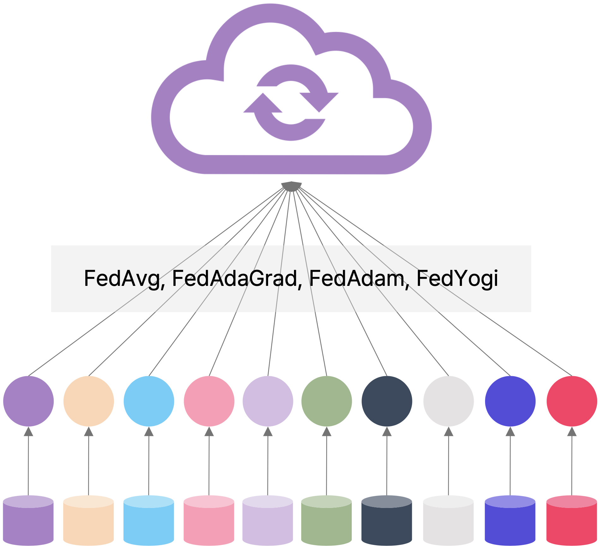
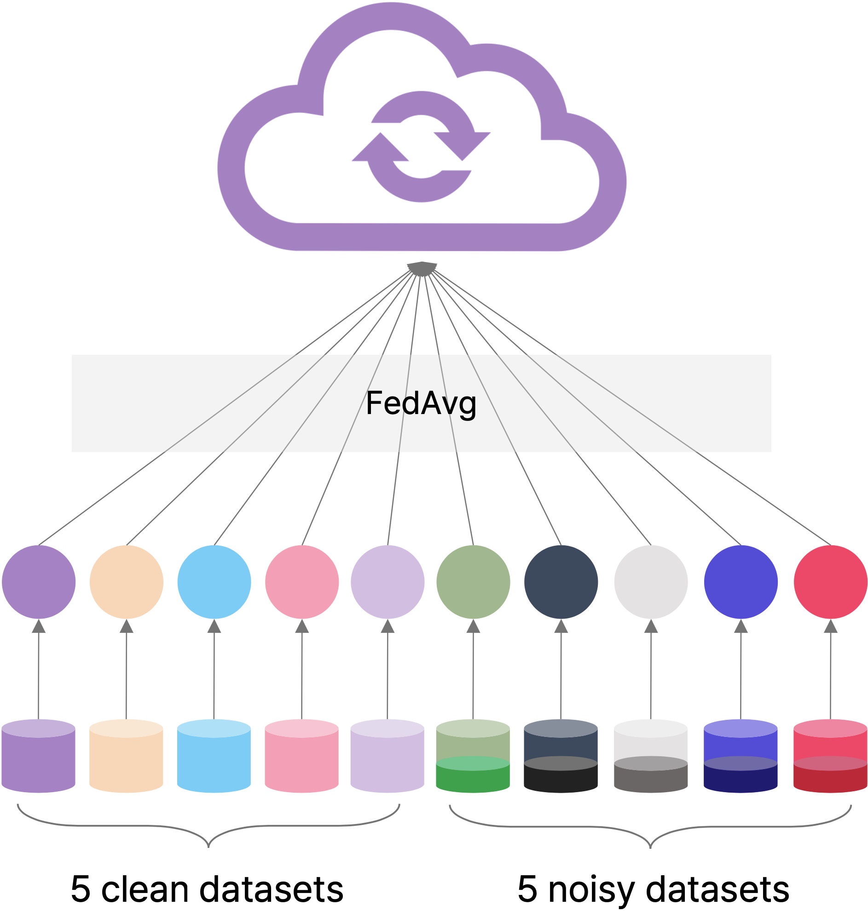
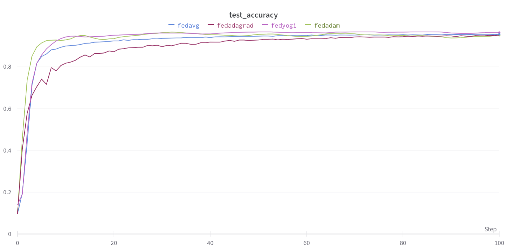
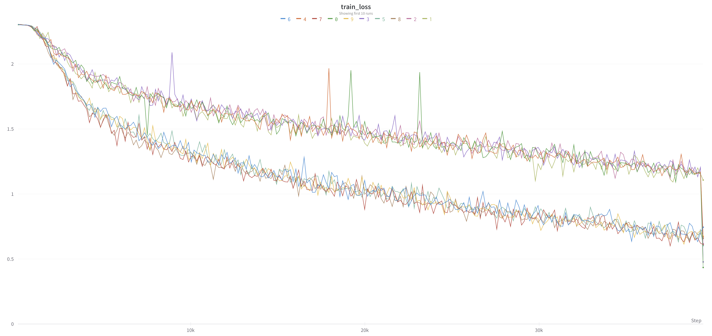
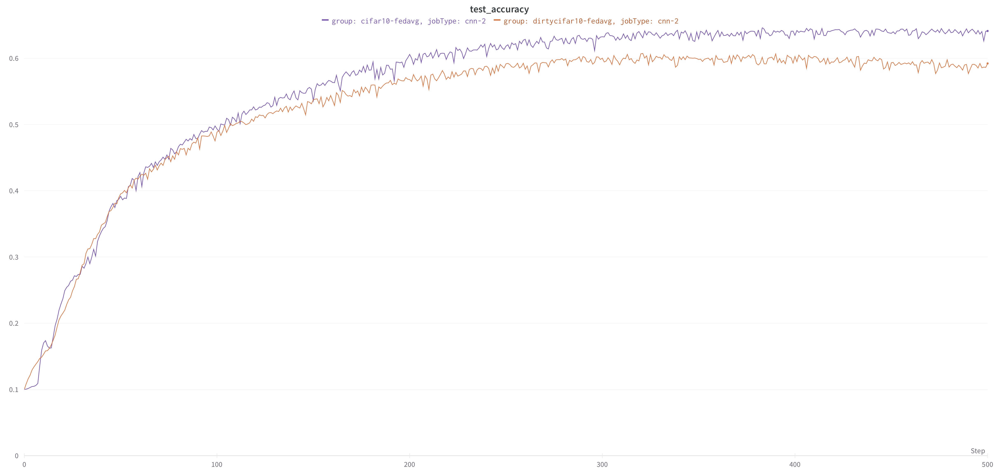

# Team Project in Database Systems Module @SeoulTech 

#### Prof. Hyukyoon Kwon
#### Team 6 {Jihyo Kim, Sungcheol Kim, Dohyeon Lee} in Department of Data Science @SeoulTech

This repository contains the code for the team project in Database Systems Module at SeoulTech lectured by Prof. Hyukyoon Kwon. A part of codes is based on the federated learning framework "[Flower](https://flower.dev)".


### Topic
We set two topics for this proejct and both two topics are demonstrated on Federated Learning([McMahan et al., 2017](https://proceedings.mlr.press/v54/mcmahan17a.html))

<table>
  <tr>
    <td valign="top"></td>
    <em>&nbsp;&nbsp;&nbsp;&nbsp;&nbsp;&nbsp;&nbsp;&nbsp;&nbsp;&nbsp;&nbsp;&nbsp;&nbsp;&nbsp;&nbsp;&nbsp;&nbsp;&nbsp;&nbsp;&nbsp;&nbsp;&nbsp;&nbsp;&nbsp;&nbsp;&nbsp;&nbsp;&nbsp;&nbsp;&nbsp;&nbsp;&nbsp;&nbsp;&nbsp;&nbsp;&nbsp;&nbsp;&nbsp;&nbsp;&nbsp;Topic 1</em>
    <td valign="top"></td>
    <em>&nbsp;&nbsp;&nbsp;&nbsp;&nbsp;&nbsp;&nbsp;&nbsp;&nbsp;&nbsp;&nbsp;&nbsp;&nbsp;&nbsp;&nbsp;&nbsp;&nbsp;&nbsp;&nbsp;&nbsp;&nbsp;&nbsp;&nbsp;&nbsp;&nbsp;&nbsp;&nbsp;&nbsp;&nbsp;&nbsp;&nbsp;&nbsp;&nbsp;&nbsp;&nbsp;&nbsp;&nbsp;&nbsp;&nbsp;&nbsp;&nbsp;&nbsp;&nbsp;&nbsp;&nbsp;&nbsp;&nbsp;&nbsp;&nbsp;&nbsp;&nbsp;&nbsp;&nbsp;&nbsp;&nbsp;&nbsp;&nbsp;&nbsp;&nbsp;&nbsp;&nbsp;&nbsp;&nbsp;&nbsp;&nbsp;&nbsp;&nbsp;&nbsp;&nbsp;&nbsp;&nbsp;&nbsp;&nbsp;&nbsp;&nbsp;&nbsp;&nbsp;&nbsp;&nbsp;&nbsp;&nbsp;&nbsp;&nbsp;&nbsp;&nbsp;&nbsp;&nbsp;Topic 2</em>
  </tr>
</table>


Topic 1. Comparison on global model update starategies
* We compare several strategies for updating the global model, and analyze the test accuracy tendency among these strategies.
* We use [MNIST](http://yann.lecun.com/exdb/mnist/) dataset for this topic and compare the tendency to [Reddi et al., 2020](https://openreview.net/forum?id=LkFG3lB13U5) which conduct comparison among these strategies on CIFAR-10 dataset.

Topic 2. Mitigating injurious effects from the harmful updates when some client models are trained with noisy dataset
* To make clean dataset without any ambiguous/corrupted/noise data is very costly. In practice, datasets are likely to be contain data such as hard to classify or wrongly labelled.
* We therefore construct a novel federated learning benchmark that some clients have noisy data in their dataset and their models are trained with that noisy data.
* We examine the effects of client models trained with noise data on test accuracy of the global model when they participate in aggregation process.
* We try a few strategies using weight norm or gradient norm clipping to reduce the effects of client models which can be harm the global model performance.
* We use [CIFAR-10](https://www.cs.toronto.edu/~kriz/cifar.html) dataset for this topic because MNIST dataset is too easy to make the task difficult even they contain strong severity of noise.


### Requirements

```
* ubuntu 18.0.4, cuda >= 10.2
* python >= 3.6.8
* torch >= 1.2.0
* wandb
* Flwr
* Ray
```

### Usage

Multi-GPU setting is available through 'num_gpu' argument in client.py.

(Topic 1) Train 10 clients with MNIST dataset in the uniform environment and update the global model following fedavg
```
echo "Starting server"
python server.py --model='cnn' --fr_rate=1.0 --datasets='mnist' --strategy='fedavg' --gpu='0' &
sleep 3  # Sleep for 3s to give the server enough time to start

for i in `seq 0 9`; do
    echo "Starting client $i"
        python client.py --client=5 --model='cnn' --datasets='mnist' --strategy='fedavg' --partition=${i} --gpu='0' &    
done

trap "trap - SIGTERM && kill -- -$$" SIGINT SIGTERM # This will allow you to use CTRL+C to stop all background processes

wait # Wait for all background processes to complete
```

(Topic 2) Train 5 clients with clean CIFAR-10 dataset and train the other 5 clients with noisy CIFAR-10 dataset
```
echo "Starting server"
python server.py --model='cnn' --fr_rate=1.0 --datasets='cifar10' --round 500 --strategy='fedavg' --gpu='0' &
sleep 3

for i in `seq 0 9`; do
    echo "Starting client $i"
    if [ $i -lt 5 ]; then
        # clients with the noisy dataset
        python client.py --client=5 --model='cnn' --datasets='dirtycifar10' --strategy='fedavg' --partition=${i} --gpu='1' &
    elif [ $i -lt 10 ]; then
        # clients with the clean dataset
        python client.py --client=5 --model='cnn' --datasets='dirtycifar10' --strategy='fedavg' --partition=${i} --gpu='2' &
    fi
done

trap "trap - SIGTERM && kill -- -$$" SIGINT SIGTERM
wait
```

        
### Arguments

* Client-side

 |    name    |  type |           available values           |                      help                         |
 |:----------:|:-----:|:------------------------------------:|:--------------------------------------------------|
 |  partition |  int  |                  int                 |              partition for datsaet                |
 |  datasets  |  str  |      mnist, cifar10, dirtycifar10    |         dataset for training each client          |
 |    model   |  str  |              cnn, resnet18           |                 model architecture                |
 |     lr     | float |                 float                |      learning rate for training each client       |
 |    clip    | float |                 float                |        max norm bound for gradient clipping       |
 |   num_gpu  |  int  |                  int                 |  the number of gpus to use for multi-gpu setting  |
 |   client   |  int  |                  int                 |               the number fo clients               |
 |  local_ep  |  int  |                  int                 |            train epochs for each client           |
 |  strategy  |  str  | fedavg, fedadagrad, fedadam, fedyogi |         the global model update strategy          |
 |    gpu     |  str  |                  str                 |                the gpu num to use                 |


* Server-side

 |    name     |  type |           available values           |                       help                         |
 |:-----------:|:-----:|:------------------------------------:|:---------------------------------------------------|
 |  datasets   |  str  |      mnist, cifar10, dirtycifar10    |       dataset for evaluate the global model        |
 |    model    |  str  |             cnn, resnet18            |                  model architecture                |
 |   fr_rate   | float |                 float                |    number of clients participating in training     |
 | fr_val_rate | float |                 float                |    number of clients participating in evaluate     |
 |    min_ac   |  int  |                  int                 | the minimum number of clients required in training |
 |  min_client |  int  |                  int                 | the minimum number of clients required in evaluate |
 |    round    |  int  |                  int                 |         the number of global model updates         |
 |   strategy  |  str  | fedavg, fedadagrad, fedadam, fedyogi |          the server model update strategy          |
 |     gpu     |  str  |                  str                 |                 the gpu num to use                 |
 
  
 
### Results
 
* Topic 1

<p align="center">
  <em>Test Accuracy of The Global Model</em>
  <br></br>
  
</p>

We compare FedAdagrad, FedAdam and FedYogi to FedAvg. FedAdam(green) and FedYogi(magenta) yield the better accuracy than FedAvg(blue). They also show fast accuracy improvement. However, FedAdaGrad(burgundy) is worse than FedAvg. We show that the accuracy tendency according to the update strategies on MNIST is similar to that of CIFAR-10.


* Topic 2

<table>
  <tr>
    <td valign="top"></td>
    <em>&nbsp;&nbsp;&nbsp;&nbsp;&nbsp;&nbsp;&nbsp;&nbsp;&nbsp;&nbsp;&nbsp;&nbsp;&nbsp;&nbsp;&nbsp;&nbsp;&nbsp;&nbsp;&nbsp;&nbsp;&nbsp;&nbsp;&nbsp;&nbsp;&nbsp;&nbsp;&nbsp;&nbsp;&nbsp;&nbsp;&nbsp;&nbsp;&nbsp;&nbsp;Train Accuracy of Client Models</em>
    <td valign="top"></td>
    <em>&nbsp;&nbsp;&nbsp;&nbsp;&nbsp;&nbsp;&nbsp;&nbsp;&nbsp;&nbsp;&nbsp;&nbsp;&nbsp;&nbsp;&nbsp;&nbsp;&nbsp;&nbsp;&nbsp;&nbsp;&nbsp;&nbsp;&nbsp;&nbsp;&nbsp;&nbsp;&nbsp;&nbsp;&nbsp;&nbsp;&nbsp;&nbsp;&nbsp;&nbsp;&nbsp;&nbsp;&nbsp;&nbsp;&nbsp;&nbsp;&nbsp;&nbsp;&nbsp;&nbsp;&nbsp;&nbsp;&nbsp;&nbsp;&nbsp;&nbsp;&nbsp;&nbsp;&nbsp;&nbsp;&nbsp;&nbsp;&nbsp;&nbsp;&nbsp;&nbsp;&nbsp;&nbsp;Test Accuracy of The Global Model</em>
  </tr>
</table>

The left figure shows that client models trained with noisy dataset(0-4) have higher loss than client models trained with clean dataset(5-9). As shown in the right figure, the global model will have damages in their performance (64.13% &#8594; 59.23%) if weights of poorly-trained client models such as 0-4 clients take part in weight aggregating process. We tried to filter that kind of client models out by weight norm of the client model or tried to reduce harmful effects by using gradient norm clipping(inspried by [Bagdasaryan et al., 2020](https://proceedings.mlr.press/v108/bagdasaryan20a.html)), but none of them shows the improvment. According to results derived from the above two figures, for implementing federated learning in real-world, it is important to filter out client models that can harm the global model performance.
 
 
 ### References

[McMahan, B., Moore, E., Ramage, D., Hampson, S., & y Arcas, B. A. (2017, April). Communication-efficient learning of deep networks from decentralized data. In Artificial intelligence and statistics (pp. 1273-1282). PMLR.](https://proceedings.mlr.press/v54/mcmahan17a.html)

[Reddi, S. J., Charles, Z., Zaheer, M., Garrett, Z., Rush, K., Konečný, J., ... & McMahan, H. B. (2020, September). Adaptive Federated Optimization. In International Conference on Learning Representations.](https://openreview.net/forum?id=LkFG3lB13U5)

[Reddi, S. J., Charles, Z., Zaheer, M., Garrett, Z., Rush, K., Konečný, J., ... & McMahan, H. B. (2020, September). Adaptive Federated Optimization. In International Conference on Learning Representations.](https://openreview.net/forum?id=LkFG3lB13U5)

[Bagdasaryan, E., Veit, A., Hua, Y., Estrin, D., & Shmatikov, V. (2020, June). How to backdoor federated learning. In International Conference on Artificial Intelligence and Statistics (pp. 2938-2948). PMLR.](https://proceedings.mlr.press/v108/bagdasaryan20a.html)
